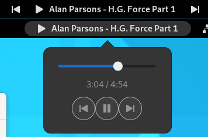

# gnome-cmus-status
A little GNOME shell extension for displaying and controlling cmus status.

## Features:
- [x] Launch cmus in a new terminal window
- [x] Add cmus control buttons (or popup caller) to right system tray with track info diplayed
- [x] Add simple key bindings to control playback (_note: setting multimedia keys as bindings may require shell restart to take effect_)
- [x] Show a notification when the song changes

## Installation

* [from GNOME extensions](https://extensions.gnome.org/extension/1934/cmus-status/) (Update fot GNOME 40 pending verification).
* from AUR: **gnome-shell-extension-cmus-status-git**
* clone/download the repository and run **make**

Remember that you need to have cmus and cmus-remote installed.
